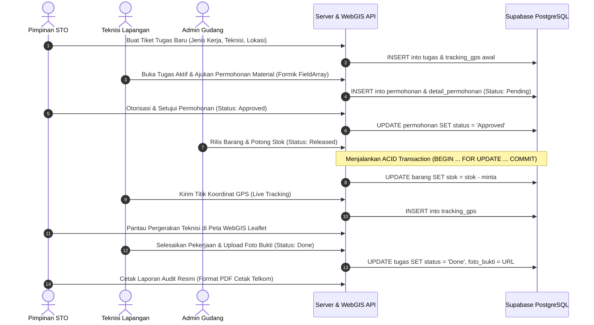

# Perancangan Sistem Informasi Manajemen Teknisi dan Inventaris Gudang Berbasis WebGIS
## STO Telkom Akses

Project Kerja Praktek (KP) — Sekolah Tinggi Teknologi Payakumbuh

**Tim:** Ari Suandi Putra, Margi Pangestu, Natasya Lutfyah Ramadhan, Raihan Alhamidy, Restui Zai

---

## Struktur Project

```
Projek-Apk-STO-Pyk/
├── sto-backend/     → Node.js (Express) + Supabase (PostgreSQL)
└── sto-frontend/    → React (Vite) + Tailwind CSS
```

> **Penting:** Semua kode backend masuk ke folder `sto-backend/`, semua kode frontend masuk ke folder `sto-frontend/`. Jangan bikin folder baru sembarangan di root — kalau bingung, tanya dulu sebelum push.

---

## Cara Setup di Laptop Masing-Masing

### 1. Clone repo (sekali aja)
```bash
git clone https://github.com/NatasyaLR26/Projek-Apk-STO-Pyk.git
cd Projek-Apk-STO-Pyk
```

### 2. Install dependency
```bash
cd sto-backend
npm install

cd ../sto-frontend
npm install
```

### 3. Minta file `.env`
File `.env` (isinya kunci Supabase) **tidak ikut ke-push** ke GitHub, demi keamanan. Minta file ini langsung ke Natasya (chat, bukan lewat GitHub), taruh di `sto-backend/.env`.

### 4. Jalankan project
Buka 2 terminal terpisah:

**Terminal 1 — backend:**
```bash
cd sto-backend
npm run dev
```
Jalan di `http://localhost:5000`

**Terminal 2 — frontend:**
```bash
cd sto-frontend
npm run dev
```
Jalan di `http://localhost:5173`

---

## Cara Push Perubahan

1. **Sebelum mulai kerja**, tarik dulu perubahan terbaru:
```bash
git pull origin main
```

2. **Setelah selesai kerja**, commit & push:
```bash
git add -A
git commit -m "tulis di sini kamu ngerjain apa"
git push origin main
```

---

## 4. Alur Kerja Operasional (SOP Sistem)

Berikut adalah diagram alur kerja operasional end-to-end yang mengintegrasikan Pimpinan STO, Teknisi Lapangan, Admin Gudang, Server Backend & WebGIS API, serta Supabase PostgreSQL:



### Rincian Tahapan SOP:
| No | Tahap / Aksi | Pelaku | Deskripsi Teknis |
|:--:|---|---|---|
| **1** | **Buat Tiket Tugas Baru** | Pimpinan STO | Pimpinan menerbitkan tiket pengerjaan (Pasang Baru / Gangguan / Maintenance) lengkap dengan lokasi pelanggan dan penugasan teknisi (atau ke pool terbuka). |
| **2** | **Inisialisasi Database** | Server API | Server mencatat data penugasan ke tabel `tugas` dan menetapkan titik awal di `tracking_gps`. |
| **3** | **Buka Tugas & Ajukan Material** | Teknisi Lapangan | Teknisi membuka tiket tugas miliknya dan menyusun daftar material (kabel drop core, ONT, roset, fast connector, dll.) menggunakan form dinamis. |
| **4** | **Pencatatan Permohonan** | Server API | Data permohonan dicatat ke tabel `permohonan` dengan status `Pending` dan item ke tabel `detail_permohonan`. |
| **5** | **Otorisasi & Approval** | Pimpinan STO | Pimpinan mengevaluasi dan memberikan otorisasi persetujuan pengeluaran logistik. |
| **6** | **Update Status Persetujuan** | Server API | Status permohonan diperbarui di Supabase PostgreSQL menjadi `Approved`. |
| **7** | **Rilis Barang Gudang** | Admin Gudang | Petugas gudang memverifikasi persetujuan, menyiapkan fisik barang, dan menekan konfirmasi pengeluaran material (`Released`). |
| **8** | **ACID Transaction Stok** | Server & Database | Sistem mengeksekusi pemotongan kuantitas stok otomatis pada tabel `barang` secara atomik (`stok = stok - minta`) untuk menjamin integritas data inventaris. |
| **9** | **Kirim Titik GPS** | Teknisi Lapangan | Perangkat teknisi secara periodik menyiarkan telemetri koordinat GPS latitude & longitude saat bergerak ke lokasi. |
| **10** | **Perekaman Telemetri** | Server API | Server menyimpan histori jejak pergerakan teknisi ke tabel `tracking_gps`. |
| **11** | **Live Tracking WebGIS** | Pimpinan STO | Pimpinan memantau pergerakan armada teknisi secara real-time di atas peta interaktif WebGIS berbasis Leaflet.js. |
| **12** | **Upload Bukti & Selesai** | Teknisi Lapangan | Teknisi menyelesaikan perbaikan/instalasi di rumah pelanggan, mengambil foto dokumentasi pekerjaan, dan menandai status tiket `Done`. |
| **13** | **Simpan Bukti Pekerjaan** | Server API | File foto disimpan ke Supabase Storage (`bukti-foto`) dan status tiket diupdate menjadi `Done` bersama tautan URL foto bukti. |
| **14** | **Cetak Laporan Audit Resmi** | Pimpinan STO | Pimpinan mencetak Berita Acara Pekerjaan & Laporan Audit resmi (format cetak dokumen standar STO Telkom Akses) untuk pertanggungjawaban operasional. |

---

## Tech Stack

- **Backend:** Node.js, Express.js, Supabase (PostgreSQL)
- **Frontend:** React, Vite, Tailwind CSS, React Router, Axios
- **WebGIS:** Leaflet.js + OpenStreetMap
- **Storage:** Supabase Storage (upload foto bukti kerja)

## Role Pengguna

- **Pimpinan** — buat tugas, approve permohonan material, lihat live tracking & laporan audit
- **Teknisi** — terima tugas, ajukan permohonan material, upload bukti foto selesai
- **Gudang** — kelola inventaris material

## Akun Testing

| Role | Email | Password |
|---|---|---|
| Pimpinan | pimpinan@sto.co.id | 123456 |
| Teknisi | teknisi@sto.co.id | 123456 |
| Gudang | gudang@sto.co.id | 123456 |
