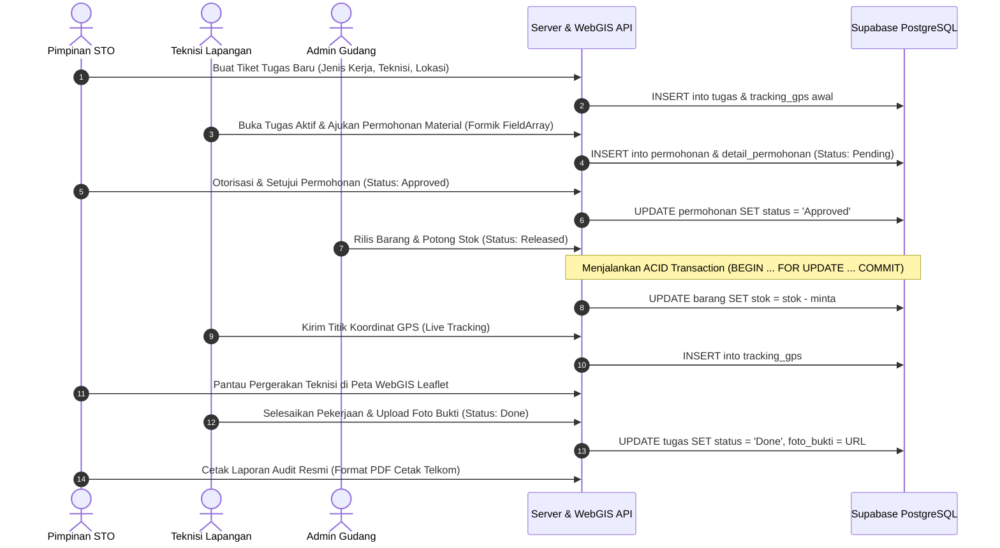

# Sistem Informasi Manajemen Teknisi & Inventaris Gudang Berbasis WebGIS
### STO Telkom Akses Payakumbuh

Aplikasi berbasis web modern (*Full-Stack WebGIS*) untuk digitalisasi pemantauan teknisi lapangan, alur permohonan dan serah terima logistik material gudang, pelacakan koordinat GPS *real-time*, serta rekapitulasi laporan audit operasional di lingkungan **PT Telkom Akses STO Payakumbuh**.

---

## 1. Arsitektur & Teknologi

* **Database (DBaaS)**: Supabase PostgreSQL (Port 5432 Pooler, SSL Encrypted)
* **Backend**: Node.js, Express.js, `pg` (PostgreSQL Client with ACID Transaction), JWT Authentication, Multer
* **Frontend**: React 18, Vite, Tailwind CSS, Lucide React Icons
* **Pemetaan WebGIS**: Leaflet.js, React-Leaflet, CartoDB Dark Matter Tile Layer, Custom Pulsing DivIcon
* **Validasi Formulir**: Formik & Yup (Strict Validation di 5 Formulir Utama)
* **Desain Sistem**: Tema Dark Mode (Slate-950 `#020617` & Slate-900 `#0f172a`), Aksen Korporat Telkom Red (`#ED1C24`), Tipografi Plus Jakarta Sans

---

## 2. Kredensial Akun Pengguna Demo

Tersedia tombol satu-klik (*Quick Fill*) pada halaman login untuk memudahkan pengujian:

| Role / Peran | Nama Pegawai | Email | Password | Akses & Fungsi Utama |
|---|---|---|---|---|
| **Pimpinan** | Pimpinan STO | `admin@sto.telkom.co.id` | `admin123` | Monitoring WebGIS Leaflet, delegasi tiket tugas, otorisasi permohonan material, cetak laporan audit |
| **Teknisi** | Ari | `ari@sto.telkom.co.id` | `teknisi123` | Tampilan mobile, pengiriman titik koordinat GPS aktual, pengajuan material dinamis, upload bukti selesai |
| **Gudang** | Petugas Gudang | `gudang@sto.telkom.co.id` | `gudang123` | CRUD inventaris stok aktual, serah terima barang dengan pemotongan stok otomatis (ACID Transaction) |

---

## 3. Struktur Database (6 Tabel Utama)

1. **`users`**: Data pegawai STO (`id`, `nama_lengkap`, `role`, `email`, `password`).
2. **`tugas`**: Tiket kerja operasional (`id`, `pimpinan_id`, `teknisi_id`, `jenis_kerja`, `lokasi`, `status`, `foto_bukti`).
3. **`barang`**: Master logistik material (`id`, `nama_barang`, `stok`, `satuan`).
4. **`permohonan`**: Header pengajuan barang oleh teknisi (`id`, `tugas_id`, `status`, `waktu_request`).
5. **`detail_permohonan`**: Rincian kuantitas material (`id`, `permohonan_id`, `barang_id`, `jumlah_minta`).
6. **`tracking_gps`**: Log histori koordinat teknisi (`id`, `tugas_id`, `latitude`, `longitude`, `waktu_update`).

---

## 4. Alur Kerja Operasional (SOP Sistem)



---

## 5. Cara Menjalankan Aplikasi

### Persyaratan:
- Node.js (v18 ke atas)
- NPM

### Menjalankan Backend Server:
```bash
cd server
npm install
npm start
# Server berjalan di http://localhost:5000
```

### Menjalankan Frontend WebGIS:
```bash
cd client
npm install
npm run dev
# Frontend berjalan di http://localhost:5173
```

### Menjalankan Uji Verifikasi Otomatis:
```bash
# Uji koneksi Supabase & tabel
node server/scripts/test-db.js

# Uji end-to-end integrasi seluruh API (Smoke Test)
node server/scripts/smoke_test.js
```

---

## 6. Fitur Unggulan

* **Zero Broken Image Leaflet**: Marker peta menggunakan custom SVG DivIcon beranimasi *pulse ring* yang adaptif di layar retina/bundler tanpa risiko broken asset.
* **Transaksional Kuat (ACID)**: Mencegah *race condition* dan selisih fisik inventaris gudang saat beberapa teknisi mengambil barang secara bersamaan.
* **Format Laporan Siap Cetak**: Fitur cetak laporan audit dilengkapi kop resmi PT Telkom Akses STO Payakumbuh, ringkasan statistik, dan kolom tanda tangan ganda via *CSS Print* (`window.print()`).
